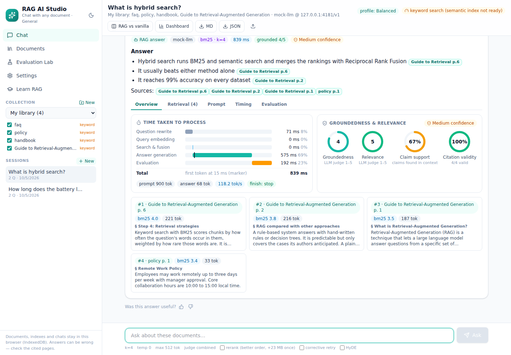
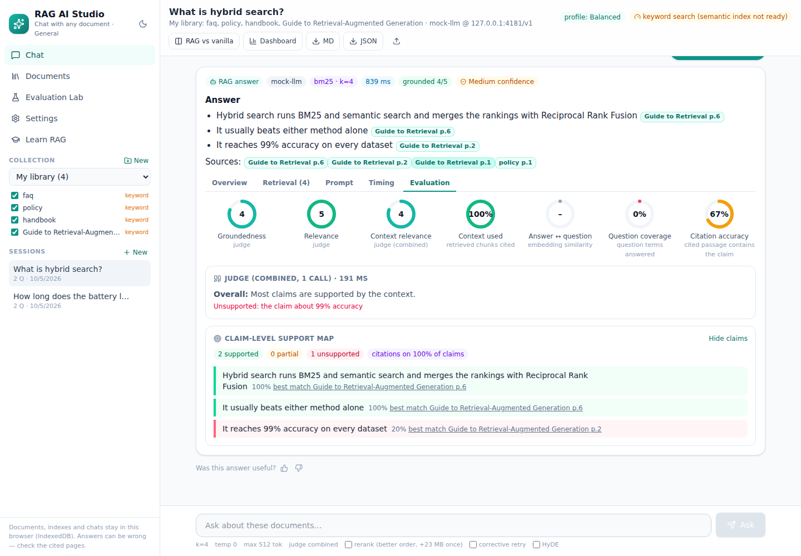
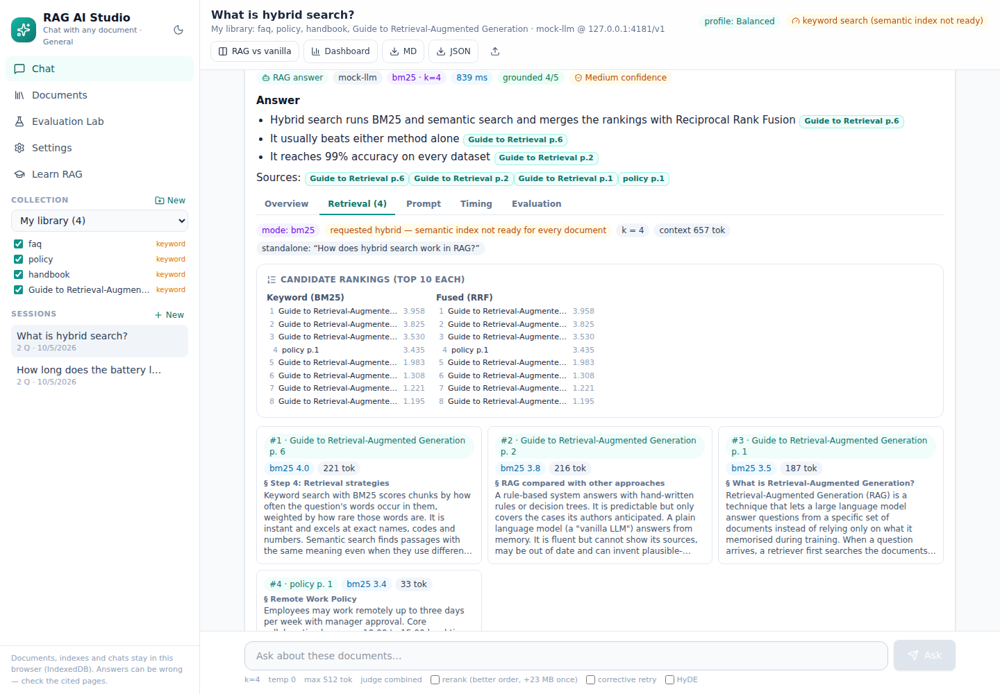
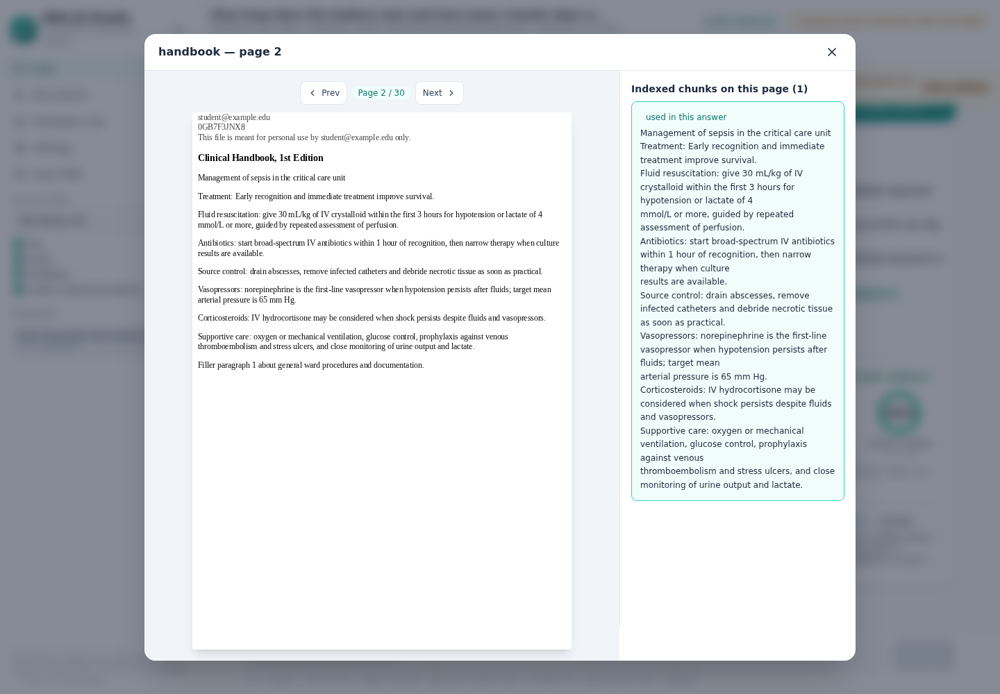
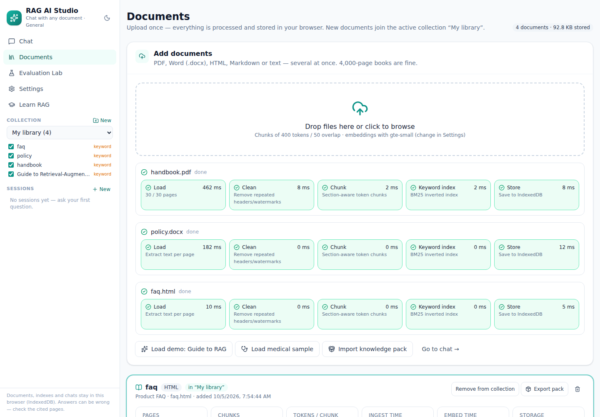
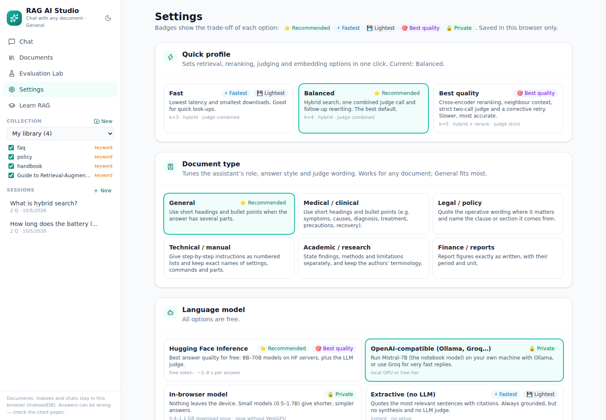
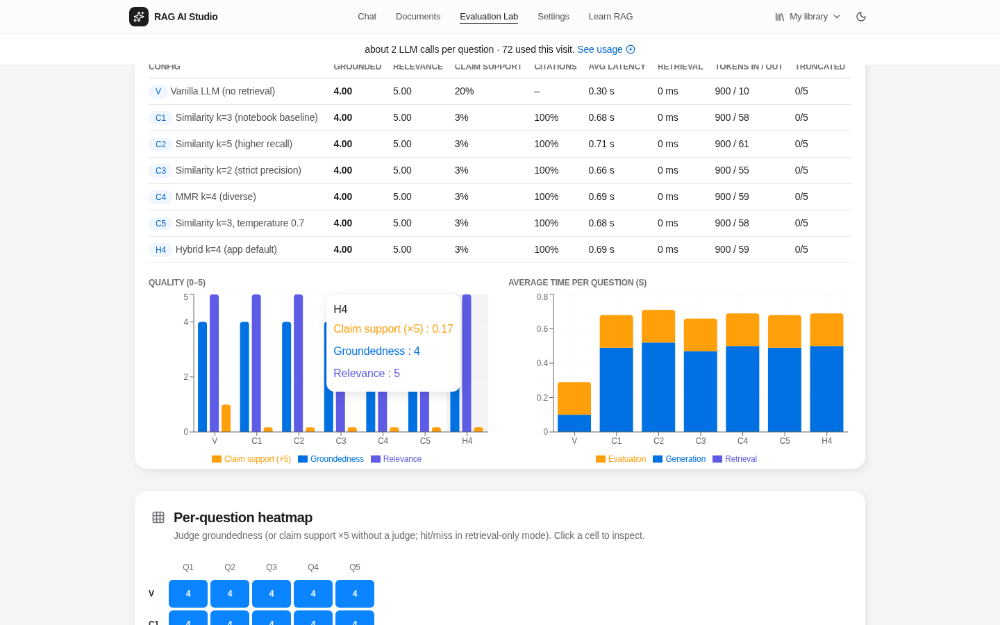

# RAG AI Studio

Chat with **any document**: manuals, policies, contracts, papers, reports, handbooks. Every answer cites the pages it
used and shows how long each step took, how well grounded it is, and how confident you can be in it. RAG AI Studio is a
React app that runs entirely in the browser, so it is free to host on GitHub Pages or Hugging Face Spaces. It needs no
server and no GPU bill, and your files never leave your machine.

It started as the web version of a Colab project ("Medical Assistant: RAG-based Clinical Decision Support using The Merck
Manual") and has been generalised to any document. "Medical" is now one of six document-type presets.

| Chat with cited answers | Per-answer evaluation |
|---|---|
|  |  |
| **Retrieval trace (BM25 / semantic / fused / reranked)** | **Citation → real PDF page** |
|  |  |
| **Documents with stage timings** | **Settings with trade-off guidance** |
|  |  |



<sub>Screenshots use the built-in demo documents and a local test model.</sub>

## What kind of AI system is this?

**A RAG-based AI solution (Retrieval-Augmented Generation).**
- **Not rule-based:** no hand-written rules produce the answers.
- **Not a plain LLM chatbot:** answers come only from retrieved passages and cite them. In the original notebook, vanilla answers
  scored 3.6/5 for groundedness, against 5.0 with RAG.
- **Not an autonomous agent:** there is no planning or tool use. Optional agent-like steps are available:
  - rewriting follow-up questions
  - HyDE query expansion
  - **Corrective RAG**, which checks its own answer and retries the search when grounding is weak

## Features

**Documents**
- Upload PDF, Word (.docx), HTML, Markdown or text files, several at once.
- Each file is parsed, cleaned and chunked off the main thread, and every stage is timed.
- Watermarks and running headers are detected automatically. Headings become section titles, and tables of contents and
  duplicate chunks are dropped.
- **Collections:** chat across several documents at once. Citations name the document: `[Policy p. 3]`.
- Keyword search (BM25) works immediately. Semantic embeddings build in the background and resume after a reload.
- **Knowledge packs:** export a processed document (chunks + int8 vectors) and import it elsewhere with no re-processing.

**Answers**
- Hybrid retrieval: BM25 and cosine similarity merged with Reciprocal Rank Fusion. BM25 uses a corpus-wide IDF, so scores
  can be compared across documents.
- Optional cross-encoder **reranking**, **neighbour expansion**, **HyDE** and **corrective retry**.
- Streaming answers with clickable citation chips. Clicking one opens the real PDF page, with the chunks that were used
  highlighted.
- Six **document-type presets**: General, Medical, Legal, Technical, Academic and Finance. Each tunes the assistant's role,
  answer style, judge wording and disclaimer.
- Starter questions are suggested for each document (written by the LLM, or taken from section titles).

**Evaluation on every answer**, in tabs (Overview · Retrieval · Prompt · Timing · Evaluation):

| Signal | How |
|---|---|
| Groundedness, relevance, context relevance (1–5) | LLM-as-a-judge. *Combined* is one call; *Strict* uses the notebook's two rubric prompts. |
| Claim support map | Each sentence of the answer is checked against the retrieved passages (judge-free). |
| Citation validity | Were the cited pages actually retrieved? |
| **Citation accuracy** | Does the cited passage actually contain the claim? Mis-attributed claims are flagged. |
| Context used | Share of the retrieved passages that the answer cites. |
| Answer ↔ question similarity | Embedding cosine similarity (RAGAS-style answer relevance). |
| Confidence | High / Medium / Low, combining all of the above, with the reasons. |
| Time taken | Question rewrite, HyDE, query embedding, search, rerank, expansion, generation (with time to first token) and evaluation. Also shows tokens/s, prompt and answer tokens, and context-window usage. |

- **Session dashboard:** p50/p95 latency, average scores, trends, where the time goes, and 👍/👎 feedback.
- **RAG vs vanilla:** answers each question with and without retrieval, side by side, and judges both.

**Evaluation Lab**
- Reproduces the notebook experiment (vanilla and C1–C5) plus hybrid, rerank and BM25 configurations.
- Write `question | expected pages` to get **hit@k, recall@k and MRR**.
- *Retrieval-only* mode tunes search settings instantly, without an LLM.
- Charts, a per-question heatmap, a best/fastest recommendation, and CSV/JSON export.

**Guidance:** every option carries ⭐ Recommended / ⚡ Fastest / 💾 Lightest / 🎯 Best quality / 🔒 Private badges, and the
**Quick profile** setting (Fast · Balanced · Best quality) applies a whole set of options in one click.

## Which options should I choose?

| Goal | Choose |
|---|---|
| Everyday default | **Balanced** profile with Hugging Face `Llama-3.1-8B-Instruct` |
| Best answer quality | **Best quality** profile (hybrid + rerank, k=5 + neighbours, strict judge, corrective RAG) with a 70B HF model |
| Fastest | **Fast** profile with extractive mode or an 8B model, and the judge off or combined |
| Least storage | MiniLM embeddings, and free the original PDFs after indexing ("Free … MB") |
| Full privacy | In-browser model or local Ollama |

## LLM options (all free)

| Provider | Setup | Notes |
|---|---|---|
| **Extractive** (default) | none | Quotes the best sentences with citations. Instant, but no LLM judge. |
| **Hugging Face Inference** ⭐ | free token from <https://huggingface.co/settings/tokens> (enable *Inference Providers*) | Llama 3.1/3.3, Qwen 2.5, Mistral, Gemma |
| **OpenAI-compatible** | e.g. `OLLAMA_ORIGINS=* ollama serve` and then `ollama pull mistral:7b-instruct` | Same Mistral-7B as the notebook. Groq and OpenRouter free tiers also work. |
| **In-browser** | none (0.4–1.1 GB downloaded once) | Private; use WebGPU (Chrome/Edge) for usable speed |

**API tokens are never saved.** The Hugging Face token (and any API key) is typed into a masked field and kept only in
the memory of the current tab. It is never written to localStorage, IndexedDB, cookies, exports or the URL, and tokens
saved by older versions are purged on load. Reloading or closing the tab erases it, so you enter it once per visit. It is sent
over HTTPS only to the provider you chose; the site has no server of its own. The **Safety** button next to the field explains
this and lists best practices: use a fine-grained token with only "Make calls to Inference Providers", and revoke it when
you're done. If your browser offers to save it as a password, choose "Never".

## Architecture

```
file ─► loader (pdf.js | mammoth | DOMParser | text) ─► pages with "## headings"
     ─► ingest worker: clean ─► section-aware chunks (400/50 tok) ─► BM25 (typed-array postings)
     ─► IndexedDB: docs · chunks · original PDF (optional)
     ─► embed worker (transformers.js, WebGPU/WASM): "doc › section\n text" ─► int8 vectors in 1,024-row shards

question ─► (rewrite follow-up) ─► (HyDE) ─► query embedding (cached)
         ─► per-document BM25 (global IDF) + top-k cosine (min-heap over int8) ─► RRF fusion
         ─► (cross-encoder rerank) ─► (neighbour expansion) ─► "[Doc p. N] (section)" context
         ─► LLM (streamed) ─► judge + claim support + citation checks + confidence ─► session (slim, ~5 writes)
```

```
src/
  lib/          engine: loaders/, clean, chunk, bm25, quant, topk, vector, retrieve, llm, pipeline,
                evaluate, prompts, presets, kb (ingest/embedding/packs), db (IndexedDB), settings
  workers/      ingest, embed, rerank, gen (Web Workers)
  state/        store.jsx (React context: settings, docs, collections, sessions, background jobs)
  components/   EvalPanel (tabs), Dashboard, PageViewer, Markdown, Sidebar, ui (OptionCard, ScoreRing…)
  views/        Chat, Documents, Evaluation Lab, Settings, Learn RAG
```

## Audit: what this refactor fixed

| Area | Before | Now |
|---|---|---|
| Session writes | Whole session written to IndexedDB on **every streamed token** | ~5 writes per answer (only on phase changes) |
| Saved answers / experiments | Full chunk text duplicated in every message | Chunk references only; text is looked up again when displayed |
| Vector storage | Float32 (~21 MB for 14k chunks), fully rewritten every 15 s | **int8 + per-row scale (~5.4 MB, 4× smaller)**, saved in 1,024-row shards |
| Vector search | Full sort of all scores per query | Bounded min-heap top-k; query embeddings cached |
| Ingest | Cleaning, chunking and BM25 on the UI thread (freezes on big books) | In a Web Worker; BM25 uses compact typed arrays |
| Page viewer | Re-parsed the whole PDF for every page | Open documents cached (LRU of 2) |
| Deploy size | ~31 MB (unused 26 MB onnxruntime wasm bundled) | **4.5 MB** (wasm loaded from jsDelivr by transformers.js) |
| Chunk quality | No section context; TOC pages and duplicates indexed | Section-aware chunks, contextual headers for embeddings, TOC/duplicate filtering |
| Judge cost | 2 LLM calls per answer | 1 combined call by default (strict 2-call mode optional) |
| Scope | Medical-only prompts and demo | Any document; 6 presets; generic "Guide to RAG" demo |
| Robustness | No lint, no error boundary | ESLint in CI, error boundary per view, 23 unit tests |

## Run locally

```bash
npm install        # .npmrc skips onnxruntime-node's unused native download
npm run dev        # http://localhost:5173
npm run lint
npm test           # cleaning, chunking, BM25, int8/top-k, multi-doc retrieval, evaluation metrics, loaders
npm run build      # static site in dist/
```

## Deploy (free)

**GitHub Pages:** `.github/workflows/deploy.yml` lints, tests and builds every PR, and deploys `main`.
One-time setup: *Settings → Pages → Build and deployment → Source: **GitHub Actions***. The site is then at
`https://<user>.github.io/<repo>/`.

**Hugging Face Spaces:** `.github/workflows/hf-space.yml` publishes the build to a static Space on every push to `main`.
One-time setup: add the repository secret `HF_TOKEN` (an HF token with write access) and the variable `HF_SPACE` (for
example `your-name/rag-ai-studio`). To publish by hand:
`npm run build && HF_TOKEN=hf_xxx HF_SPACE=you/rag-ai-studio python scripts/push_to_hf_space.py dist`.

## Roadmap

1. **OCR for scanned PDFs** (tesseract.js, loaded lazily) so image-only pages can be indexed.
2. **Answer cache:** reuse answers to semantically identical questions (cosine above 0.97) to save time and LLM credits.
3. **Shareable collections:** publish knowledge packs to a Hugging Face dataset and open them with a link.
4. **Table-aware chunking:** keep table rows together, and add a CSV/XLSX loader.
5. **Optional server mode** (FastAPI + Chroma/pgvector) for corpora too large for one browser, using the same UI.
6. **PWA / offline install** after the first model download.
7. **More evaluation:** NLI-based faithfulness with a small in-browser model, a judge that differs from the generator,
   and automatic question-set generation with expected pages.
8. **Internationalisation** and multilingual embeddings (e.g. `multilingual-e5-small`).

## Limitations

- The embedding model (23–34 MB) is downloaded on first use, then cached. With WebGPU, a 4,000-page book (~14k chunks)
  embeds in minutes; on CPU it takes longer, but keyword search works in the meantime.
- Groundedness is measured against the *retrieved* passages, not against the truth: a retrieval miss can still score well.
  Use context relevance and the Evaluation Lab's hit@k to catch that.
- Answers support research and decisions; they don't replace professional judgement. Check the cited pages.
