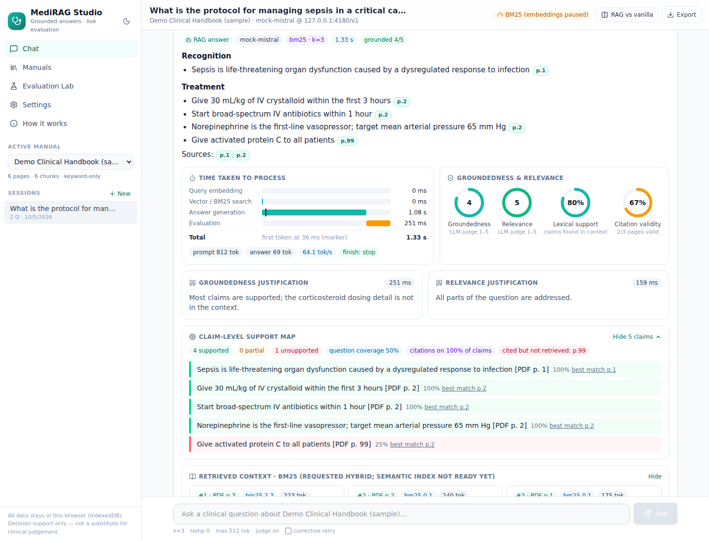
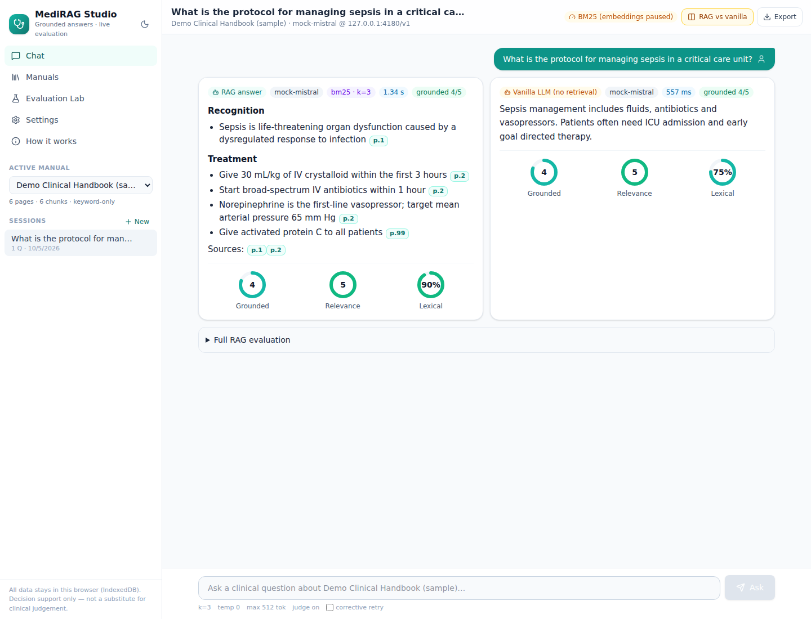
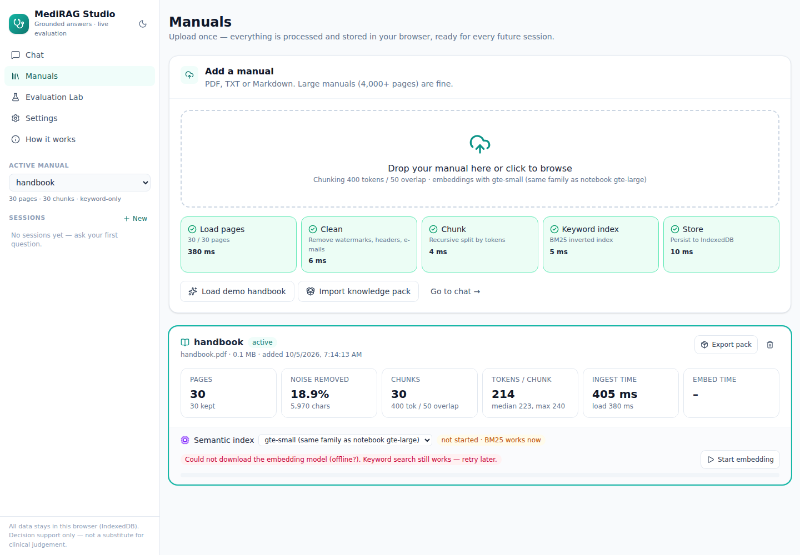
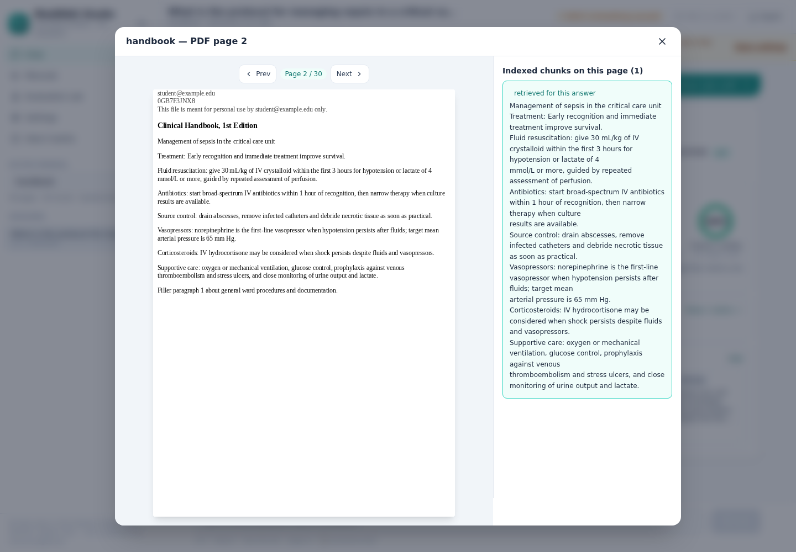
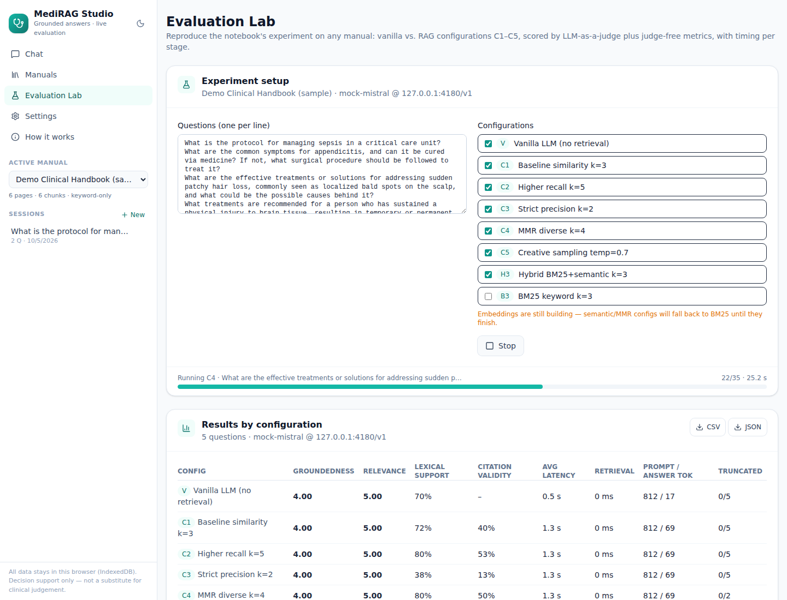

# MediRAG Studio

Chat with a medical manual and see how well each answer is grounded. This is the web version of the Colab project
**"Medical Assistant: RAG-based Clinical Decision Support using The Merck Manual"**. It runs entirely in the browser,
so it can be hosted for free on GitHub Pages or Hugging Face Spaces, with no server and no GPU bill.

- **Upload once, reuse forever.** PDFs are parsed, cleaned, chunked and indexed in the browser, then stored in IndexedDB.
- **Sessions.** Each manual has its own chat sessions. They persist across visits and can be exported as Markdown.
- **Grounded answers with real page citations.** Clicking `p.175` opens the actual PDF page next to the retrieved chunk.
- **Evaluation for every answer:**
  - Time per stage (query embedding, search, generation with a time-to-first-token marker, evaluation) and tokens/s
  - Groundedness and relevance scored 1–5 by an LLM judge, using the notebook's rubric prompts
  - A judge-free claim-level support map that flags sentences not found in the retrieved context
  - Citation validity (whether the cited pages were actually retrieved) and question coverage
- **RAG vs vanilla mode.** Answers the same question with and without retrieval, side by side, as in the notebook.
- **Evaluation Lab.** Reruns the notebook experiment (vanilla, C1–C5, hybrid, BM25) on any manual. Shows charts and a per-question heatmap, exports CSV/JSON, and includes your Colab results for reference.
- **Corrective RAG (optional).** If an answer is weakly grounded, the app rewrites the query in clinical terms, retrieves more context and keeps the better answer.
- **Knowledge packs.** Export a processed manual (chunks + embeddings) as one file. Others can import it and start chatting instantly, with no re-embedding.

| Chat + live evaluation | RAG vs vanilla |
|---|---|
|  |  |
| **Manual ingestion with stage timings** | **Citation → real PDF page** |
|  |  |



<sub>Screenshots use the bundled demo handbook and a local test model.</sub>

## What kind of AI system is this?

**A RAG-based AI solution (Retrieval-Augmented Generation).** It is not rule-based, because no hand-written rules produce
the answers. It is not a plain LLM chatbot, because answers are restricted to retrieved manual pages and cite them. It is not an
autonomous AI agent either: the notebook's pipeline is a fixed *retrieve → generate → evaluate* chain. The only agent-like
behaviour is the optional **Corrective RAG** step, a self-check-and-retry loop. With it enabled, the app could be called
"agentic RAG-lite".

## Architecture

```
PDF ──pdf.js──► pages ──clean──► chunks (400 tok / 50 overlap) ──► BM25 index        (instant)
                                         └──transformers.js──► gte-small vectors     (background, resumable)
                                                             ▼
question ─► hybrid retrieval (BM25 + cosine, RRF) ─► top-k chunks + [PDF p.] tags
         ─► LLM (HF Inference / Ollama / in-browser / extractive) ─► cited answer (streamed)
         ─► evaluation: LLM judge (groundedness, relevance) + claim support + citation check + timings
                                                             ▼
                                         IndexedDB: manuals, chunks, vectors, sessions, experiments
```

| Notebook (Colab, T4) | MediRAG Studio (browser) |
|---|---|
| PyMuPDFLoader | pdf.js (page numbers preserved) |
| Regex watermark removal | Automatic boilerplate detection (lines on ≥30% of pages, e-mails, licence notices) |
| RecursiveCharacterTextSplitter 400/50 | Same algorithm and sizes |
| gte-large + ChromaDB | gte-small / bge-small / MiniLM (transformers.js) + IndexedDB, plus BM25 & hybrid |
| Mistral-7B-Instruct GGUF | Any of: HF Inference Providers, Ollama/OpenAI-compatible, in-browser Qwen/Llama, extractive |
| LLM-as-a-judge | Same prompts + judge-free metrics + timing waterfall |

## LLM options (all free)

| Provider | Setup | Notes |
|---|---|---|
| **Extractive** (default) | none | Quotes the best manual sentences with citations. Instant and 100% grounded, but no prose or LLM judge. |
| **Hugging Face** | free token from <https://huggingface.co/settings/tokens> (enable *Inference Providers*) | Llama 3.1 8B, Qwen 2.5, Mistral, Gemma… within HF's free monthly credits. |
| **OpenAI-compatible** | e.g. `OLLAMA_ORIGINS=* ollama serve` + `ollama pull mistral:7b-instruct` | Runs the same Mistral-7B as the notebook on your own machine. Groq/OpenRouter free tiers also work. |
| **In-browser** | none (downloads ~0.4–1 GB once) | Fully private; fastest with WebGPU (Chrome/Edge). |

Keys are stored only in your browser's localStorage and sent only to the provider you pick.

## Run locally

```bash
cd medirag
npm install        # .npmrc skips onnxruntime-node's unused native download
npm run dev        # http://localhost:5173
npm test           # unit tests: cleaning, chunking, BM25, vector search, evaluation metrics
npm run build      # static site in dist/
```

## Deploy (free)

**GitHub Pages:** `.github/workflows/deploy.yml` tests and builds on every PR and deploys `main` to Pages.
Do this once: *Settings → Pages → Build and deployment → Source: **GitHub Actions***.
The site is then served at `https://<user>.github.io/<repo>/`.

**Hugging Face Spaces:** `.github/workflows/hf-space.yml` publishes the build to a static Space on every push to `main`.
Do this once: add the repository secret `HF_TOKEN` (an HF token with *write* access) and the repository variable
`HF_SPACE` (for example `your-hf-name/medirag-studio`). The Space is created automatically. To publish by hand instead:

```bash
npm run build && HF_TOKEN=hf_xxx HF_SPACE=you/medirag-studio python scripts/push_to_hf_space.py dist
```

Any other static host (Netlify, Vercel, Cloudflare Pages) also works: serve `dist/`.

## Notes and limitations

- The first time you embed a manual, the embedding model (~30–60 MB) is downloaded and then cached. With WebGPU, a 4,000-page
  manual (about 14k chunks) embeds in minutes; on CPU it takes longer, but keyword search works immediately and embedding
  resumes after a reload.
- Scanned (image-only) PDFs need OCR before upload.
- As the notebook points out, groundedness is measured against the *retrieved* context, not against clinical truth. A retrieval
  miss can still score 5/5, so check the cited pages.
- This is decision support for clinicians. It does not replace clinical judgement.
